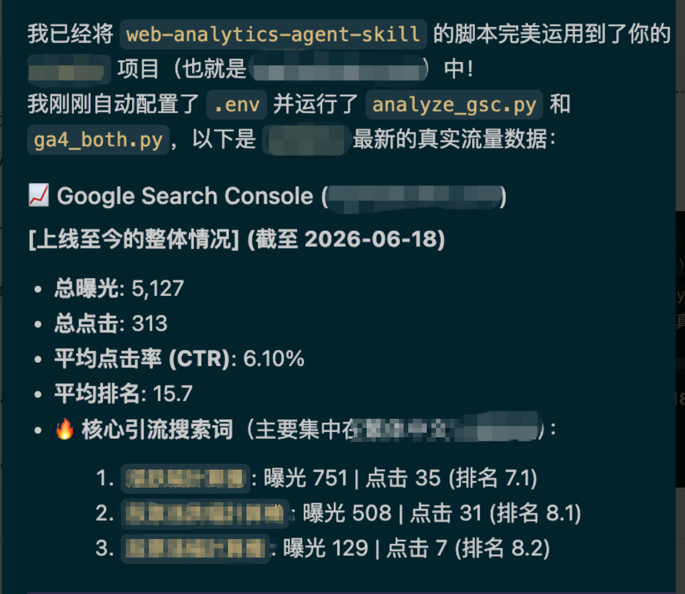
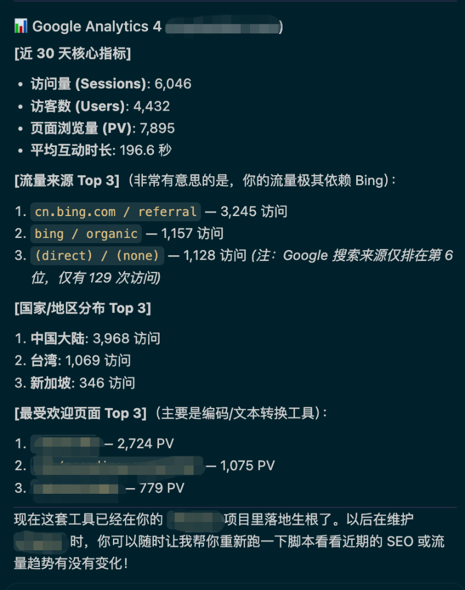
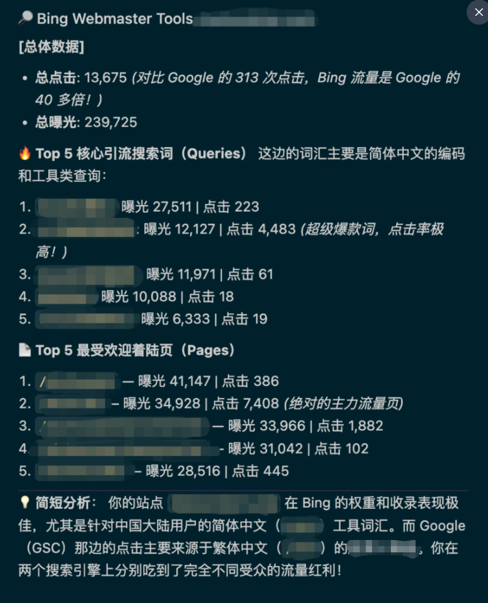

# Web Analytics Agent Skill

<p align="center">
   <strong>Google Search Console</strong><br><br>
   <strong>Google Analytics 4</strong><br><br>
   <strong>Bing Webmaster</strong>
</p>

[English](./README.md) | [简体中文](./README.zh-CN.md) | [繁體中文](./README.zh-TW.md) | [日本語](./README.ja.md)


這是一個強大的 **AI Agent 技能包** 與 **Python 自動化分析腳本**，旨在為您提供網站流量的 360 度全景視圖。本項目無縫對接了 **Google Search Console (GSC)**、**Google Analytics 4 (GA4)** 以及 **Bing Webmaster Tools** 的官方 API。無論您是需要讓大模型自主進行 **SEO 流量診斷**、**關鍵詞挖掘**，還是搭建日常的**流量監控流水線**，該項目都能開箱即用。

**關鍵字 / 標籤**: `seo-agent`, `ai-seo`, `web-analytics`, `ga4`, `google-analytics`, `google-search-console`, `seo-automation`, `agent-skill`, `mcp-server`

## 📥 如何安裝 (Installation)
對於目前主流的 AI 智能體（如 Cursor, Cline, Claude Code, Antigravity 等），最簡單且最推薦的安裝方式是直接**將本倉庫的地址發送給 AI**，讓 AI 自主閱讀並掛載此技能。

**您可以直接把下面這句話複製發給您的 AI 助手：**
> "Please read and install this AI Agent Skill: https://github.com/SeoToolkit/web-analytics-agent-skill . Read the `SKILL.md` file carefully to understand how to use it."

或者，如果您的 AI 助手支援直接在本地工作區讀取技能，您只需將其複製到專案下：
```bash
git clone https://github.com/SeoToolkit/web-analytics-agent-skill.git .skills/web-analytics-agent-skill
```

## 📊 效果演示 (Example Reports)

| Google Search Console | Google Analytics 4 | Bing Webmaster Tools |
| :---: | :---: | :---: |
|  |  |  |

## 🛠️ 核心特性
- **Google Search Console**: 自動獲取 Google 搜索排名、曝光與點擊轉化率。
- **Google Analytics 4 (GA4)**: 追蹤真實的用戶會話、留存時間及流量來源。
- **Bing Webmaster Tools**: 支持跨搜索引擎的流量比例分析與異常檢測。

## 📦 環境準備
1. 創建虛擬環境並安裝依賴：
   ```bash
   python3 -m venv .venv
   source .venv/bin/activate
   pip install -r requirements.txt
   ```
2. 複製 `.env.example` 為 `.env`，然後根據您需要的渠道進行以下配置：

### 渠道 1：Bing Webmaster Tools
- **授權方式**: API 密鑰 (手動獲取)
- **配置步驟**:
  1. 訪問 [Bing Webmaster Tools](https://www.bing.com/webmasters/)。
  2. 點擊右上角齒輪圖標(設置) -> API 訪問 -> API 密鑰。
  3. 生成並複製您的 API 密鑰。
- **環境變量** (`.env`):
  - `BING_API_KEY`: 您剛才複製的 API 密鑰。
  - `BING_SITE_URL`: 您的 Bing 驗證域名（例：`https://example.com`）。

### 渠道 2：Google Search Console (GSC)
- **授權方式**: OAuth 2.0 (手動獲取 `client_secret.json` + 自動彈窗授權)
- **配置步驟**:
  1. 訪問 [Google Cloud Console](https://console.cloud.google.com/) 創建新項目。
  2. 在頂部搜索欄中搜索並啟用 **Google Search Console API**。
  3. 配置「OAuth 同意屏幕」（選擇外部應用，將您的郵箱添加為測試用戶）。
  4. 進入左側「憑據」菜單 -> 點擊頂部「+ 創建憑據」 -> 選擇「OAuth 客戶端 ID」。
  5. 應用類型選擇「桌面應用 (Desktop app)」，創建完畢後下載 JSON 文件。
  6. 將下載的文件重命名為 `client_secret.json`，並把它放在項目根目錄下。
  7. *(自動)* 首次運行腳本時，系統會自動彈出瀏覽器讓您登錄並授權。
  > **💡 重要提醒**：請確保彈窗登錄的 Google 賬號**擁有該 GSC/GA4 站點的訪問權限**，並在授權界面**手工勾選允許**讀取 Search Console 和 Analytics 數據的選框。如果因為漏選或賬號不對導致 403 權限錯誤，AI 智能體在執行時會自動捕獲並提醒您檢查。
- **環境變量** (`.env`):
  - `GSC_SITE_URL`: Google Search Console 的資源 URL（例：`sc-domain:example.com`）。
  - `SITE_LAUNCH_DATE`: (可選) 您網站的上線日期，用於計算「上線至今」的趨勢數據（格式：`YYYY-MM-DD`）。

### 渠道 3：Google Analytics 4 (GA4)
- **授權方式**: OAuth 2.0 (復用 GSC 的 `client_secret.json` + 自動彈窗授權)
- **配置步驟**:
  1. 在剛才的 Google Cloud 項目中，繼續搜索並啟用 **Google Analytics Data API**。
  2. 確保 `client_secret.json` 文件已經在項目根目錄下。
  3. *(自動)* 首次運行腳本時，系統會自動彈出瀏覽器讓您登錄並授權。
- **環境變量** (`.env`):
  - `GA4_PROPERTIES`: 您的 GA4 屬性 ID 及標籤（格式必須為 `ID=標籤`，例：`123456789=MyWebsite`）。

## 📄 配置文件格式範例

以下是您需要準備的兩個核心配置文件的格式要求：

### 1. `.env`
在項目根目錄下創建該文件，按需填寫您所需的渠道：
```ini
# Bing Webmaster Tools
BING_API_KEY=your_bing_api_key_here
BING_SITE_URL=https://yourdomain.com

# Google Search Console
GSC_SITE_URL=sc-domain:yourdomain.com
SITE_LAUNCH_DATE=2024-01-01

# Google Analytics 4
GA4_PROPERTIES=123456789=yourdomain.com
```

### 2. `client_secret.json`
這是從 Google Cloud Console 下載下來的原始憑證文件，它的標準格式如下（請勿修改其內部結構）：
```json
{
  "installed": {
    "client_id": "YOUR_CLIENT_ID.apps.googleusercontent.com",
    "project_id": "your-project-id",
    "auth_uri": "https://accounts.google.com/o/oauth2/auth",
    "token_uri": "https://oauth2.googleapis.com/token",
    "auth_provider_x509_cert_url": "https://www.googleapis.com/oauth2/v1/certs",
    "client_secret": "YOUR_CLIENT_SECRET",
    "redirect_uris": ["http://localhost"]
  }
}
```

## 🚀 運行步驟
當 AI 智能體需要進行流量診斷時，最簡單的方式是直接執行自動化入口腳本。它會自動創建虛擬環境、安裝依賴並依次執行所有分析：
```bash
./run_all.sh
```
或者，您也可以手動激活環境並執行單個腳本：
- `scripts/auth_google.py`: 專門用於處理 Google OAuth 2.0 授權的腳本。獨立運行它可以生成 `token.json` 本地授權文件。*（注意：其他腳本在發現缺失 token 時也會自動觸發此授權流程，所以手動運行它是可選的）*。
- `scripts/analyze_gsc.py`: 用於獲取和分析 Google Search Console 數據。
- `scripts/ga4_both.py`: 用於獲取和分析 Google Analytics 4 數據。
- `scripts/bing_webmaster.py`: 用於獲取和分析 Bing Webmaster Tools 數據。

```bash
source .venv/bin/activate
python3 scripts/auth_google.py
```

## 🤖 支援的 AI 智能體 (Supported Agents)
由於本技能採用標準 CLI 腳本架構，通過終端標準輸出（STDOUT）返回結構化數據，因此**原生支持任何具備終端執行能力的 AI 智能體**，完全無需複雜的接口適配：
- **Claude Code** (Anthropic 官方 CLI 智能體)
- **Antigravity** (Google DeepMind 智能體)
- **Cursor & Windsurf** (具備終端執行能力的 IDE 智能體)
- **Open Interpreter**
- **基於 Codex 的智能體及 Copilot Workspace**
- 任何基於 LangChain, AutoGen 或 CrewAI 構建的自定義 Agent

## 💬 給 AI 的提示詞示例 (Example Prompts)
您可以直接將以下提示詞複製給您的 AI 助手（如 Claude、ChatGPT 等）：
- *"執行流量診斷腳本 `./run_all.sh`，幫我檢查 Google Search Console 和 GA4 近 7 天的數據，並寫一份總結報告。"*
- *"調用 web analytics 技能，對比我在 Bing 和 Google 上的搜索流量，告訴我哪些關鍵詞在 Bing 上表現更好。"*
